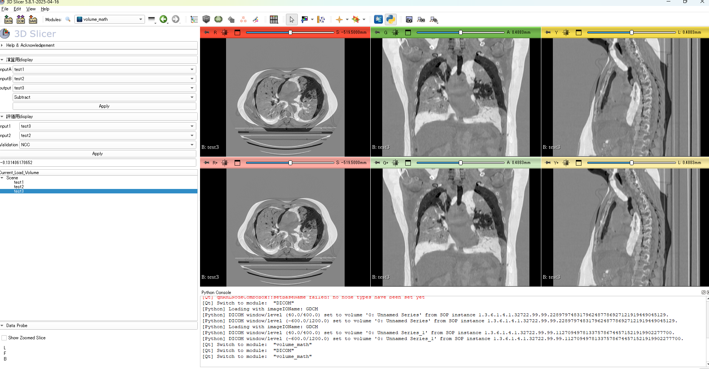

#  Volume Math Extension（3D Slicer）

## 概要
本プロジェクトは、3D Slicer上で医用画像に対して演算処理および評価指標計算を行う  
**カスタム拡張モジュール**です。

従来、ImageJを用いて個別に実施していた画像演算や評価（MSE・NCCなど）を、  
研究室で使用している3D Slicer環境に統合しました。

複数ツール間で分断されていた処理を一元化することで、

- ワークフローの簡略化
- 再現性の向上
- 医用画像解析の効率化

放射線治療や画像比較において必要となる  
**画像間の差分・類似度評価（MSE / NCC）**を実装しました。

---

##  目的
- 医用画像の演算処理の効率化
- 画像間の定量評価の実装
- 研究用途（線量評価・画像比較）への応用

---

##  対応環境
- 3D Slicer：5.8
- OS：Windows

---

##  主な機能

###  画像演算
- Add（加算）
- Subtract（差分）
- Multiply（乗算）
- Divide（除算）
- Min / Max
- Square（2乗）
- Square Root（平方根）
- Absolute（絶対値）

---

###  論理演算
- AND
- OR
- NOT
- XOR

---

###  評価指標（重要）
### MSE（Mean Squared Error）

2つの画像の画素値の差の二乗平均を表す指標。

$$
MSE = \frac{1}{N} \sum_{i=1}^{N} (I_1(i) - I_2(i))^2
$$

- $I_1, I_2$：比較する画像
- $N$：画素数

---

### NCC（Normalized Cross-Correlation）

2つの画像の類似度を評価する指標。

$$
NCC = \frac{\sum_{i=1}^{N} I_1(i) \cdot I_2(i)}
{\sqrt{\sum_{i=1}^{N} I_1(i)^2} \cdot \sqrt{\sum_{i=1}^{N} I_2(i)^2}}
$$

- 値の範囲：-1 ～ 1
- 1に近いほど類似度が高い

---

##  実装の工夫

- VTKパイプラインで処理
- 出力時にメタデータ（spacing / origin）維持
- 単一画像 / 複数画像の両方に対応

---

##  入出力仕様

### 入力
- DICOMデータ（Slicerから読み込み）

### 出力
- 既存ボリューム上書き
- 新規ボリューム生成

※ DICOM出力時はint16に変換されるため、  
float精度を保つ場合はNRRD形式推奨 

---

## ▶️ 使用方法

### ① インストール
- Extensionをzipからインストール

### ② データ読み込み
- DICOM ImportからCTを読み込み

### ③ 演算選択
- 入力ボリュームを指定
- 演算を選択
- 実行

---

##  想定ユースケース
- DIR結果の評価
- 放射線治療における画像比較
- Gamma解析前処理

---

##  技術スタック
- C++
- Qt（UI）
- VTK / ITK
- 3D Slicer API

---

## ⚠️ 課題
- UIの改善余地あり
- 大規模データでの高速化
- GPU対応未実装

---

##  今後の展望
- SSIMなど追加指標の実装
- GPU対応（CUDA）
- バッチ処理機能
- DICOMエクスポート改善

---
